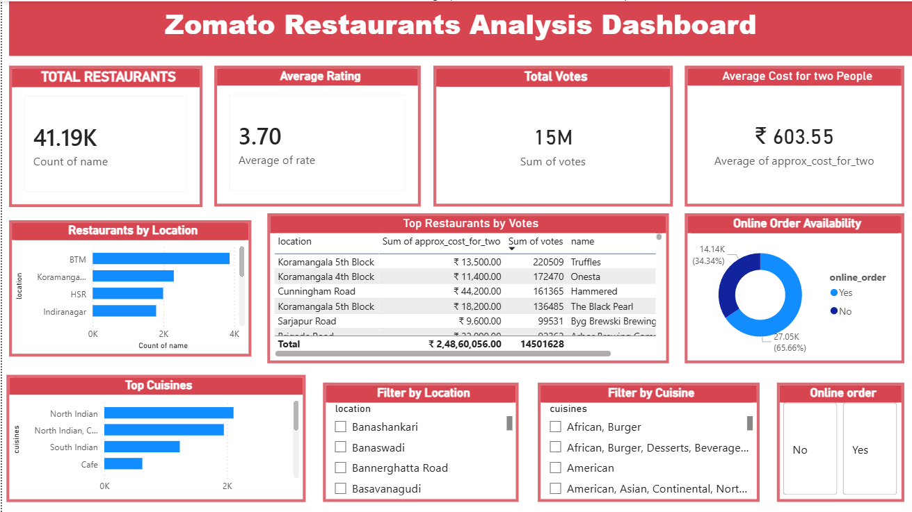

# Zomato Restaurant Data Analysis

## Project Overview

In this project, I analyzed Zomato restaurant data to understand patterns in restaurant ratings, cuisines, pricing, and location distribution. The goal was to explore how restaurants are spread across different locations and what factors influence their ratings and popularity.

Using data analysis and visualization tools, I transformed the raw dataset into meaningful insights and built an interactive Power BI dashboard to present the findings.

---

## Problem Statement

Food delivery platforms like Zomato contain thousands of restaurant listings. However, it can be difficult to understand trends such as which locations have more restaurants, what cuisines are most popular, and whether higher prices actually lead to better ratings.

The purpose of this project was to analyze restaurant data and uncover patterns that help answer questions such as:

* Which locations have the highest number of restaurants?
* What are the most popular cuisines?
* How do ratings vary across different restaurants?
* Is there any relationship between price and restaurant ratings?

---

## Tools & Technologies Used

* Python (Pandas) – Data cleaning and preprocessing
* SQL – Data analysis queries
* Power BI – Data visualization and dashboard creation
* Excel – Dataset handling
* GitHub – Project documentation and version control

---

## Project Workflow

1. Collected the Zomato dataset.
2. Cleaned and prepared the data using Python (Pandas).
3. Performed analysis using SQL queries to explore different patterns.
4. Built an interactive Power BI dashboard to visualize insights.
5. Documented the project and uploaded it to GitHub.

---

## Dashboard Insights

The Power BI dashboard provides insights such as:

* Total number of restaurants in the dataset
* Average restaurant ratings
* Total number of votes received by restaurants
* Average cost for two people
* Restaurant distribution by location
* Most popular cuisines
* Online order availability

These visualizations help quickly understand how restaurants are distributed and how customers interact with them.

---

## Key Insights

Some interesting findings from the analysis include:

* India has the highest number of restaurants in the dataset.
* A few cuisines dominate the majority of restaurant listings.
* Restaurants with higher prices do not always have higher ratings.
* Some locations have significantly more restaurants compared to others.

---

## Impact of This Analysis

This analysis helps understand customer preferences and restaurant trends. The insights can be useful for:

* Identifying popular cuisines in different locations
* Understanding how pricing affects restaurant ratings
* Helping businesses choose better restaurant locations
* Supporting data-driven decisions in the food delivery industry

---

## Project Files

The repository includes:

* Cleaned dataset used for analysis
* Python notebook for data cleaning
* SQL queries used for analysis
* Power BI dashboard file
* Dashboard preview image

---

## Author

This project was created as part of my data analysis portfolio to demonstrate skills in data cleaning, exploratory data analysis, SQL querying, and dashboard creation.
